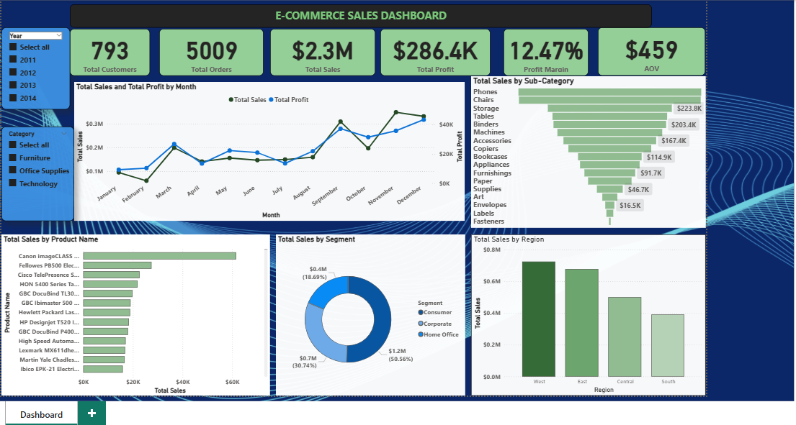

# FUTURE_DS_01
This is an interactive Sales Performance dashboard built to analyze e-commerce data to identify best selling products, sales trends, and high-revenue categories using Power BI.

# 📊 E-commerce Sales Analytics Dashboard

A comprehensive Power BI dashboard built to analyze and visualize sales performance for an e-commerce business. This project was completed as a simulated internship task to transform raw data into actionable business insights.

 <!-- Make sure to add your dashboard image to the repo and link it here -->

## 🎯 Project Overview

This project involved building an interactive dashboard from scratch to help business owners and decision-makers understand key sales metrics. The goal was to identify trends, top-performing products, and customer segments to drive strategic decisions.

**Business Questions Answered:**
- What are the best-selling products and categories?
- When do sales peak throughout the year?
- Which customer segments and regions generate the most revenue?
- What is the overall profit margin and average order value?

## 🛠️ Process & Methodology

1.  **Data Acquisition & Understanding:** Sourced the e-commerce sales dataset containing over 500,000 transactions.
2.  **Data Cleaning & Transformation:** Processed the raw data in Power Query to handle missing values, standardize formats, and create a clean, analysis-ready dataset.
3.  **Data Modeling:** Established relationships between tables (if applicable) to build a robust data model.
4.  **KPI & Measure Development:** Used DAX (Data Analysis Expressions) to create calculated columns and measures for key metrics like Total Sales, Total Profit, Profit Margin, and Average Order Value (AOV).
5.  **Dashboard Design & Visualization:** Built an intuitive and visually cohesive dashboard in Power BI with various charts and filters for interactive exploration.

## 📈 Key Features of the Dashboard

- **High-Level KPIs:** Track Total Sales, Total Profit, Profit Margin, and Average Order Value (AOV) at a glance.
- **Sales & Profit Trend:** A line chart visualizing monthly sales and profit performance to identify seasonality and growth.
- **Sales by Sub-Category:** A bar chart breaking down revenue by product sub-category (e.g., Phones, Chairs, Storage).
- **Sales by Segment:** A donut/pie chart showing sales distribution across Consumer, Corporate, and Home Office segments.
- **Sales by Region:** A map or bar chart illustrating revenue generated from different geographical regions.
- **Top Products:** A horizontal bar chart listing the best-selling products by name.
- **Interactive Filters:** Slicers for `Year` and `Category` (Furniture, Office Supplies, Technology) allow users to drill down into specific data segments.

## 🧮 Key Metrics & Insights

- **Total Sales:** **$2.3M**
- **Total Profit:** **$286.4K**
- **Profit Margin:** **12.47%**
- **Average Order Value (AOV):** **$459**

**Notable Insights:**
- **Phones** and **Chairs** are the top-performing product sub-categories.
- The **Consumer** segment is the largest contributor to revenue.
- The dashboard reveals clear monthly sales trends, with identifiable peaks, aiding in inventory and marketing planning.

## 🚀 Skills Demonstrated

- **Data Preparation:** Power Query for ETL (Extract, Transform, Load).
- **Data Modeling:** Creating table relationships and a star schema.
- **DAX:** Creating calculated columns and measures for complex calculations.
- **Data Visualization:** Designing effective and user-friendly reports in Power BI.
- **Business Intelligence:** Translating data into actionable insights and business storytelling.

## 📁 Project Structure
